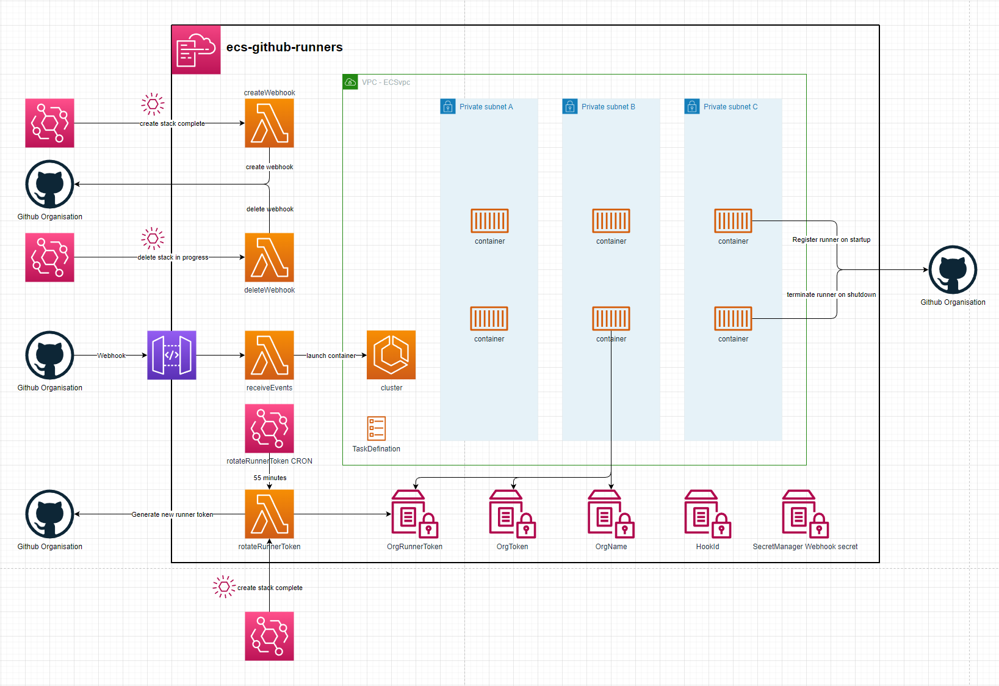

# ECS-Github-Runners

  

## setup

  1. Generating a Github Org token.
An Admin will need to generate an access token allowing access to Webhooks & Self-Hosted Runners

  2. Deploy the stack using your cli of choice. You will need to specify:
     1. Your Organisation Name - githubOrgNameParam
     2. Your Access Token - githubOrgTokenParam
  3. When the stack finishes creating it will:
     1. Create a webhook on your organisation - The webhook id will be saved as an SSM Parameter
     2. Create the initial runner token to be used by the ecs runners. This token only lasts 60 minutes & will be rotated every 55 minutes
  4. The stack is now ready to receive webhook events. It will scale out an ECS container when it receives a webhook event for a queued workflow and scale it in once the job finishes

## ECS Container

The container used by the Github runners is `amazonlinux:2023`. It then installs a few libraries and registers the github runner to your org. It can take up-tp a minute to install the necessary libraries. Using a custom docker image can minimize start-up times and provide all the libraries commonmly needed for your workflows.
